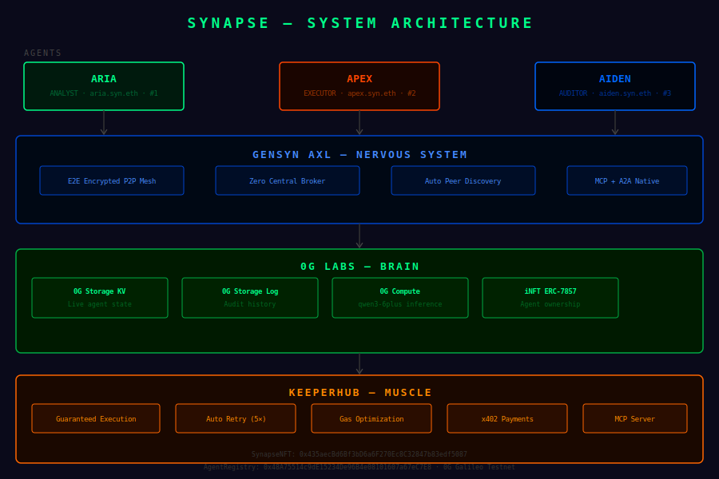

# Sample Hardhat Project

This project demonstrates a basic Hardhat use case. It comes with a sample contract, a test for that contract, and a Hardhat Ignition module that deploys that contract.

Try running some of the following tasks:

```shell
npx hardhat help
npx hardhat test
REPORT_GAS=true npx hardhat test
npx hardhat node
npx hardhat ignition deploy ./ignition/modules/Lock.js
```
| Contract | Network | Address |
|---|---|---|
| SynapseNFT | 0G Galileo Testnet | 0x435aecBd6Bf3bD6a6F270Ec8C32847b83edf5087 |
| AgentRegistry | 0G Galileo Testnet | 0x48A75514c9dE15234De96B4e08101607a67eC7E8 |

# KeeperHub Integration Feedback
## Project: SYNAPSE — ETHGlobal Open Agents 2026

### What Worked Well
- MCP server concept is exactly what agents need
- Workflow builder UI is intuitive
- API key generation was smooth
- Documentation structure is clear

### UX/UI Friction
- No way to test workflow without real funds
- Workflow ID not prominently displayed
- Missing sandbox/testnet mode for hackathons

### Documentation Gaps
- No Python SDK examples (only JS shown)
- x402 payment flow docs are incomplete
- Missing rate limit documentation
- No webhook callback documentation

### Bugs Found
- Workflow builder sometimes loses state on refresh
- API response format not documented clearly

### Feature Requests
- Python SDK (huge for AI agent builders)
- Testnet/sandbox mode for free testing
- Agent-specific workflow templates
- Webhook callbacks for async tx confirmation
- Dashboard for monitoring agent transactions

### Overall Experience
KeeperHub solves a real problem for autonomous
agents. The execution reliability layer is exactly
what APEX needed. Main gap is Python support and
testnet sandbox for hackathon builders.

## Architecture Diagram



## Deployed Contracts

| Contract | Address | Explorer |
|---|---|---|
| SynapseNFT | 0x435aecBd6Bf3bD6a6F270Ec8C32847b83edf5087 | [View](https://chainscan-galileo.0g.ai/address/0x435aecBd6Bf3bD6a6F270Ec8C32847b83edf5087) |
| AgentRegistry | 0x48A75514c9dE15234De96B4e08101607a67eC7E8 | [View](https://chainscan-galileo.0g.ai/address/0x48A75514c9dE15234De96B4e08101607a67eC7E8) |

---
 
## Demo
 
**Live Dashboard:** `localhost:3001` (run `cd dashboard && npm run dev`)
 
**KeeperHub Workflow:** [app.keeperhub.com/workflows/h1dw848zbb6mhhvxrhf4i](https://app.keeperhub.com/workflows/h1dw848zbb6mhhvxrhf4i)
 
**0G Explorer:** [chainscan-galileo.0g.ai](https://chainscan-galileo.0g.ai/address/0xFB441BB76B0595ec2B2e48cE1bC7C5a3983ee4E4)
 
---

---
 
## Architecture
 
```
┌─────────────────────────────────────────────────┐
│                  SYNAPSE_OS                      │
│                                                  │
│   ARIA ──────────── APEX ──────────── AIDEN      │
│ (Reasoning)    (Execution)        (Audit)        │
│     │               │                │           │
│     └───── AXL P2P Mesh ────────────┘           │
│                     │                            │
│              KeeperHub MCP                       │
│           (Guaranteed Execution)                 │
│                     │                            │
│           0G Galileo Testnet                     │
│        (SynapseNFT + AgentRegistry)              │
│                     │                            │
│           0G Decentralized Storage               │
│           (Agent Memory / KV Store)              │
└─────────────────────────────────────────────────┘
```

---
 
## Contract Addresses (0G Galileo Testnet)
 
| Contract | Address |
|---|---|
| SynapseNFT | `0xFB441BB76B0595ec2B2e48cE1bC7C5a3983ee4E4` |
| AgentRegistry | `0xCDaA7cAbF5486dE8cD577B3eFEb78e5477D840e2` |
 
- [SynapseNFT on 0G Explorer](https://chainscan-galileo.0g.ai/address/0xFB441BB76B0595ec2B2e48cE1bC7C5a3983ee4E4)
- [AgentRegistry on 0G Explorer](https://chainscan-galileo.0g.ai/address/0xCDaA7cAbF5486dE8cD577B3eFEb78e5477D840e2)
---